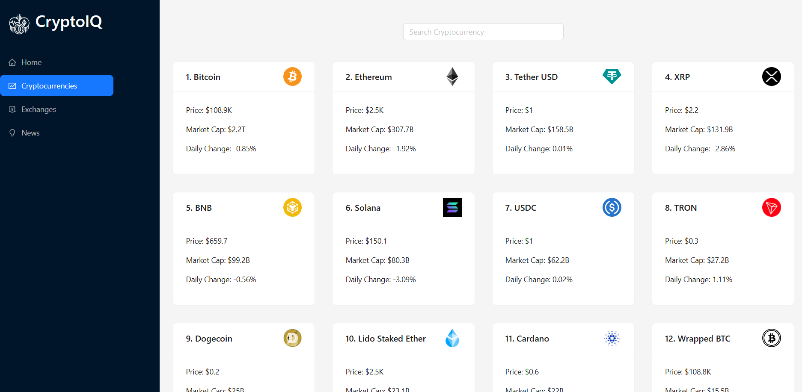
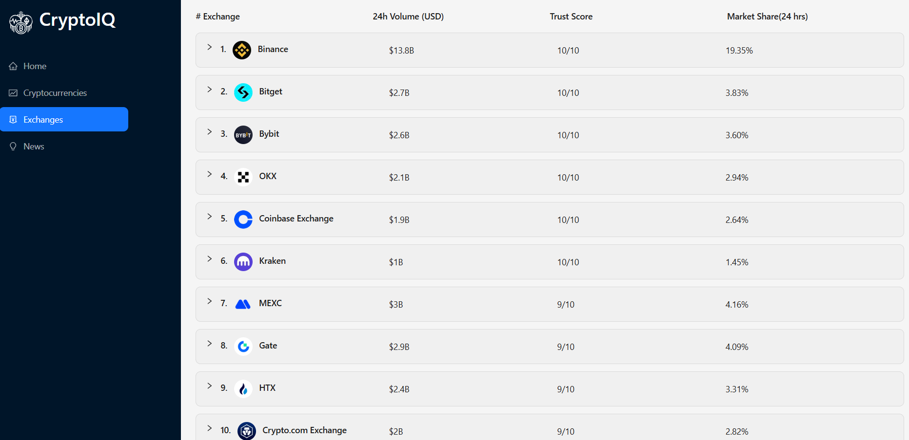
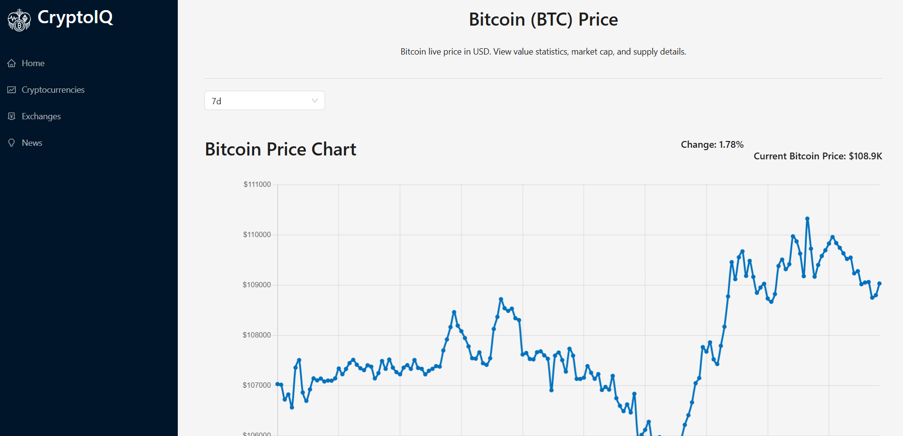

# CryptoIQ - React Crypto Interface 💹

CryptIQ is a fully responsive React-based cryptocurrency interface developed by **Jagrav Jassi**. It provides global crypto statistics, price trends, and the latest news using real-time data from CoinRanking and CoinGecko APIs.

## 📌 Features

- 🌍 Global crypto statistics (market cap, 24h volume, total coins, etc.)
- 📈 Top 10 cryptocurrencies with quick access to full coin list
- 📰 Live crypto news powered by CoinGecko
- 📊 Dynamic price charts using Chart.js
- 💡 Clean and responsive UI with Ant Design
- 🔁 Time range filtering for price history
- ⚛️ Built with modern React 

## 🏠 Homepage Overview

The homepage includes:

- **Global Crypto Stats** — fetched from both CoinRanking and CoinGecko
- **Top 10 Cryptos** — quick preview with millified stats
- **Latest Crypto News** — short summaries with source links

Each section is visually distinct and clearly labeled for user-friendly navigation.

## 🖼️ Screenshots

### Homepage


### Cryptocurrencies List


### Exchanges Page


### News Section


### Coin Chart Page


### Crypto Deyails


## ⚙️ Installation & Setup

1. Clone the repo:

   ```bash
   git clone https://github.com/yourusername/cryptiq.git
   cd cryptiq
   ```

2. Install dependencies:

   ```bash
   npm install
   ```

3. Set up environment variables:

   Create a `.env` file in the root directory:

   ```
   REACT_APP_RAPIDAPI_KEY=your_rapidapi_key
   REACT_APP_CRYPTO_RAPIDAPI_HOST=coinranking1.p.rapidapi.com
   REACT_APP_CRYPTO_API_URL=https://coinranking1.p.rapidapi.com
   ```

4. Start the development server:

   ```bash
   npm start
   ```

## 🛠️ Technologies Used

- React 
- Redux Toolkit & RTK Query
- React Router DOM
- Ant Design
- Chart.js
- CoinRanking API
- CoinGecko API
- millify (for number formatting)
- HTML React Parser (for rendering rich text descriptions)

## 👨‍💻 About the Developer

Hi! I'm **Jagrav Jassi**, a passionate web developer exploring the world of web development, APIs, and modern UI/UX design.  
CryptIQ is a part of my learning journey — combining crypto data, clean design, and advanced React patterns.

📫 Feel free to connect:

- GitHub: https://github.com/Jagrav-Jassi17
- LinkedIn: https://www.linkedin.com/in/jagrav-jassi-737a11299


> Give this repo a ⭐ if you found it useful!
